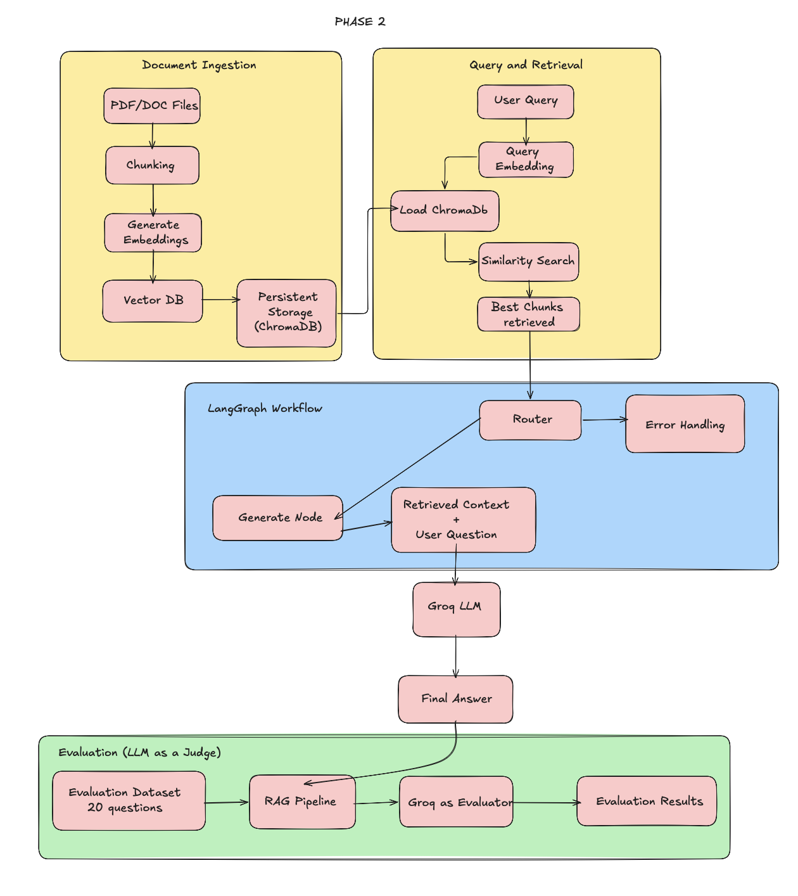

# RAG Internship Project – Retrieval Augmented Generation Pipeline

An end-to-end Retrieval-Augmented Generation (RAG) pipeline built using LangChain, LangGraph, Groq LLMs, embeddings, and ChromaDB for context-aware question answering and evaluation. This repository documents the full progression of the project — from foundational RAG concepts (Phase 1) to a production-style, optimized RAG pipeline (Phase 2) with formal evaluation using RAGAS.

---

## Pipeline Architecture



---

## Project Phases

### Phase 1 – RAG Basics
`RAG_Phase1_Basics.ipynb`
Covers the fundamentals of building a RAG system: document loading, basic chunking, embeddings, vector storage, and simple retrieval + generation.

### Phase 2 – Optimized RAG Pipeline
`Phase2_RAG_beforeImprovement.ipynb` → `RAG_Optimized_Final.ipynb`
Builds on Phase 1 with an improved, LangGraph-orchestrated pipeline, better chunking/retrieval strategies, Groq LLM integration, and a hybrid retrieval approach. Includes a before/after notebook pair showing the baseline pipeline and the final optimized version.

### Evaluation
`evaluation_results/`
Contains the RAGAS-based evaluation comparing the baseline pipeline against the hybrid/optimized pipeline.

---

## Features

* Document ingestion and preprocessing
* Text chunking for efficient retrieval
* Embedding generation using Google Generative AI Embeddings
* Vector storage and similarity search with ChromaDB
* Retrieval-Augmented Generation workflow
* LangGraph-based pipeline orchestration
* Groq LLM integration for response generation
* Wikipedia-based document retrieval
* Hybrid retrieval pipeline (baseline vs. improved comparison)
* RAGAS-based evaluation (answer relevancy, faithfulness, context precision/recall)
* LLM-as-a-Judge evaluation for additional qualitative assessment

---

## Technologies Used

* Python
* LangChain
* LangGraph
* Groq API
* ChromaDB
* Google Generative AI Embeddings
* RAGAS (evaluation framework)
* Jupyter Notebook / Google Colab

---

## Repository Structure

```text
RAG_Phase1_Basics.ipynb              -> Phase 1: foundational RAG pipeline
Phase2_RAG_beforeImprovement.ipynb   -> Phase 2: baseline pipeline before optimization
RAG_Optimized_Final.ipynb            -> Phase 2: final optimized/hybrid RAG pipeline
pipeline.png                         -> Pipeline architecture diagram
requirements.txt                     -> Required dependencies
.gitignore                           -> Ignored files and folders
README.md                            -> Project documentation

evaluation_results/
    README.md                        -> Evaluation methodology and notes
    baseline_ragas_results.csv       -> RAGAS scores for the baseline pipeline
    hybrid_ragas_results.csv         -> RAGAS scores for the hybrid/optimized pipeline
    comparison_table.png             -> Side-by-side metric comparison table
    ragas_comparison_barplot.png     -> Bar plot comparing baseline vs. hybrid results
```

---

## Workflow Overview

1. Load and preprocess documents
2. Split documents into chunks
3. Generate vector embeddings
4. Store embeddings in ChromaDB
5. Retrieve relevant context based on user queries (baseline and hybrid strategies)
6. Generate responses using Groq LLM
7. Evaluate generated responses using RAGAS and LLM-based judging
8. Compare baseline vs. optimized pipeline performance

---

## Setup Instructions

### 1. Clone the Repository

```bash
git clone <YOUR_GITHUB_REPOSITORY_LINK>
```

### 2. Install Dependencies

```bash
pip install -r requirements.txt
```

### 3. Configure API Keys

Set the following environment variables or Colab secrets:

* `GROQ_API_KEY`
* `GOOGLE_API_KEY`

---

## Running the Project

Run the notebooks in order:

1. `RAG_Phase1_Basics.ipynb` – foundational pipeline
2. `Phase2_RAG_beforeImprovement.ipynb` – baseline Phase 2 pipeline
3. `RAG_Optimized_Final.ipynb` – final optimized/hybrid pipeline

Run all cells sequentially in each notebook to execute the complete RAG workflow. Evaluation outputs are stored in `evaluation_results/`.

---

## Evaluation

The project includes both a RAGAS-based evaluation and an LLM-as-a-Judge approach to assess:

* Answer Relevancy
* Faithfulness
* Context Precision / Recall
* Context Alignment

Results comparing the baseline pipeline to the hybrid/optimized pipeline are available in `evaluation_results/`, including CSV score files, a comparison table, and a bar plot visualization.

---

## Author

Diya Mathews
